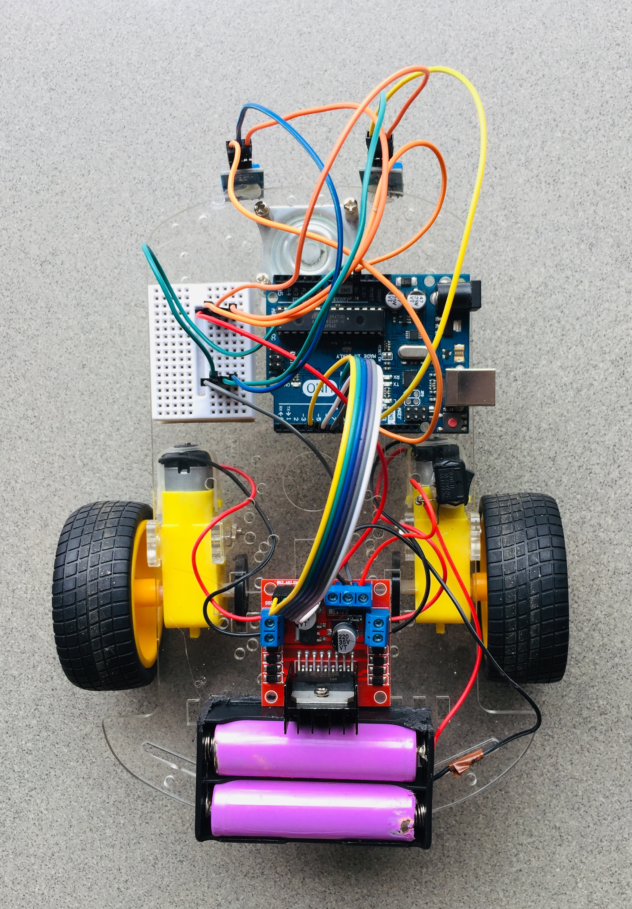
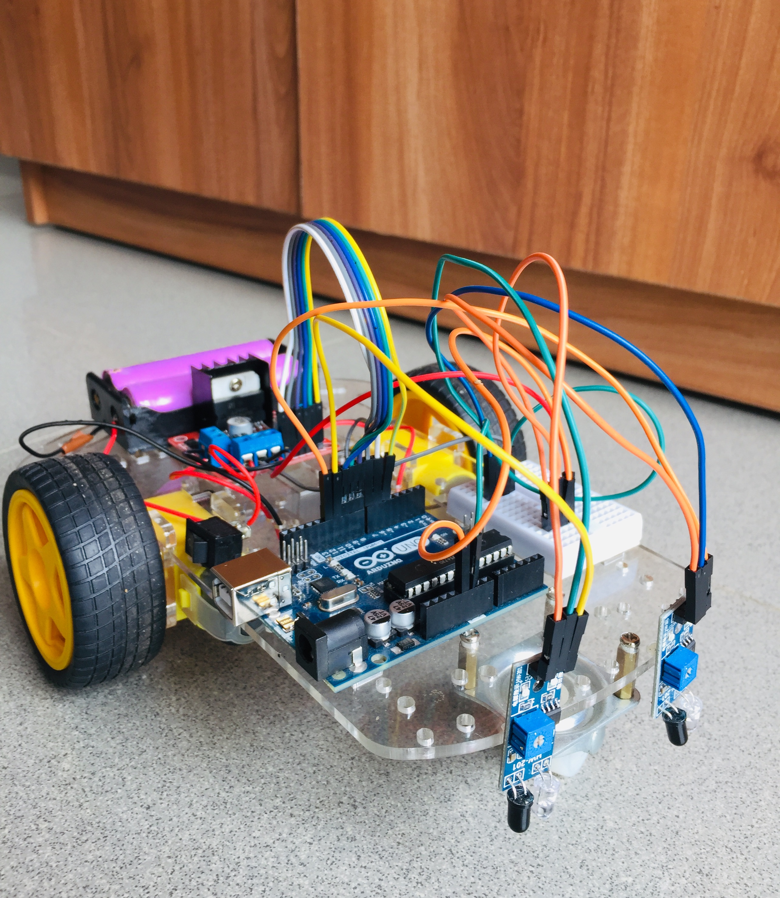
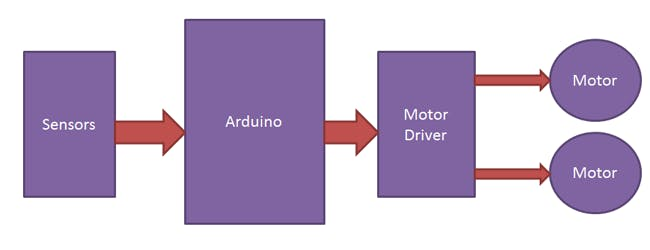
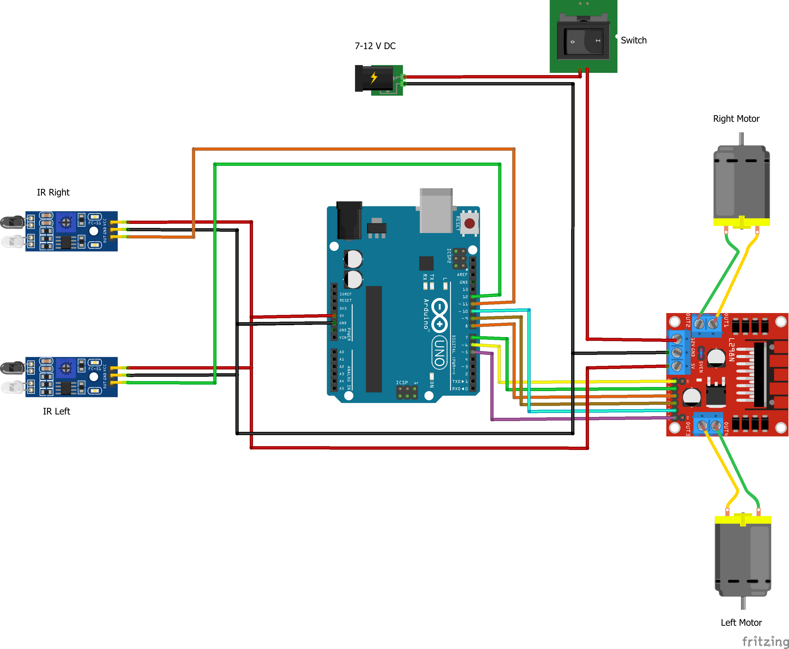

# line-follower-robot-car

A Line Follower Robot, as the name suggests, is an automated guided vehicle, which follows a visual line embedded on the floor or ceiling. Usually, the visual line is the path in which the line follower robot goes and it will be a black line on a white surface

**Author**

- Jathujan Mahendran, Community Innovator at Dream Space Academy.

**Acknowledgmen**t 

- Jerushan Sritharan, Guardian of Electronics Lab, Dream Space Academy.

- Rathees Koneswaran,  Community Maker at Dream Space Academy. 

- Sajeev Punithakaran, Community Maker at Dream Space Academy.

### Concepts of Line Follower

The concept of working of line follower is related to light. We use the behavior of light at black and white surface. When light falls on a white surface it is almost fully reflected and in the case of a black surface light is completely absorbed. This behavior of light is used in building a line follower robot.

In this arduino based line follower robot, we have used IR Transmitters and IR receivers also called photodiodes. They are used for sending and receiving light. IR transmits infrared lights. When infrared rays falls on white surface, it’s reflected back and caught by photodiodes which generate some voltage changes. When IR light fall on a black surface, light is absorbed by the black surface and no rays are reflected back, thus the photodiode does not receive any light or rays.

### Components Required:

* Arduino Uno
* Chassis
* Two battery-operated motors and compatible tyres
* Two infrared sensors
* Motor driver module - L298N
* Power Supply
* Arduino IDE software

### Working of Line Follower Robot using Arduino

Working of line follower is very interesting. Line follower robot senses black line by using sensor and then sends the signal to arduino. Then arduino drives the motor according to sensors' output.

### Circuit diagram 

